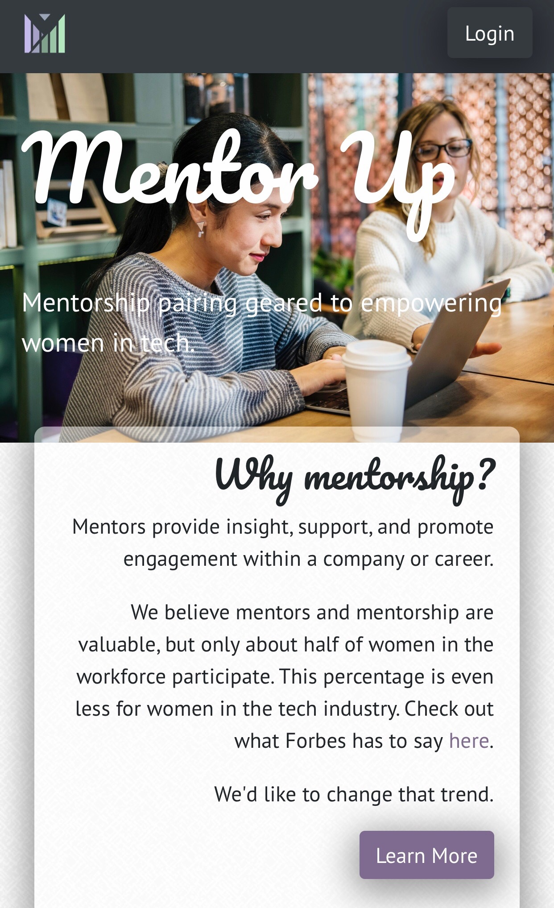
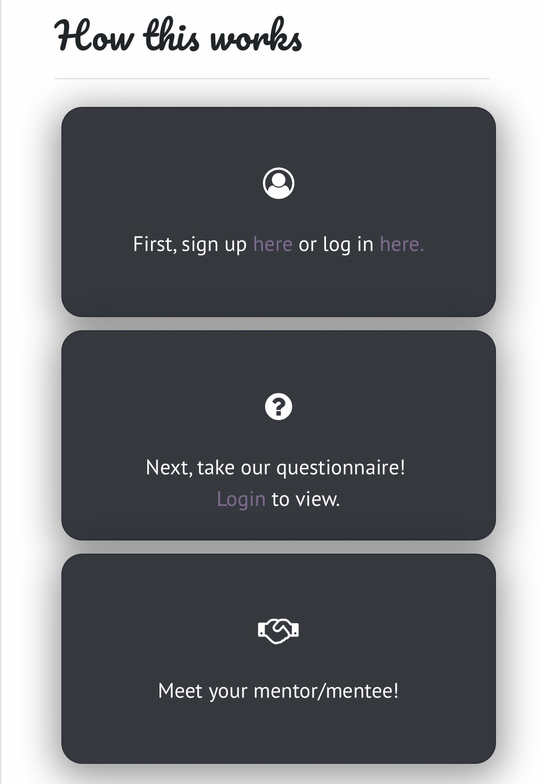
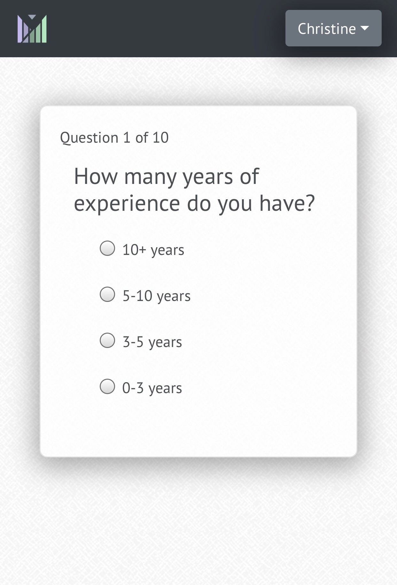
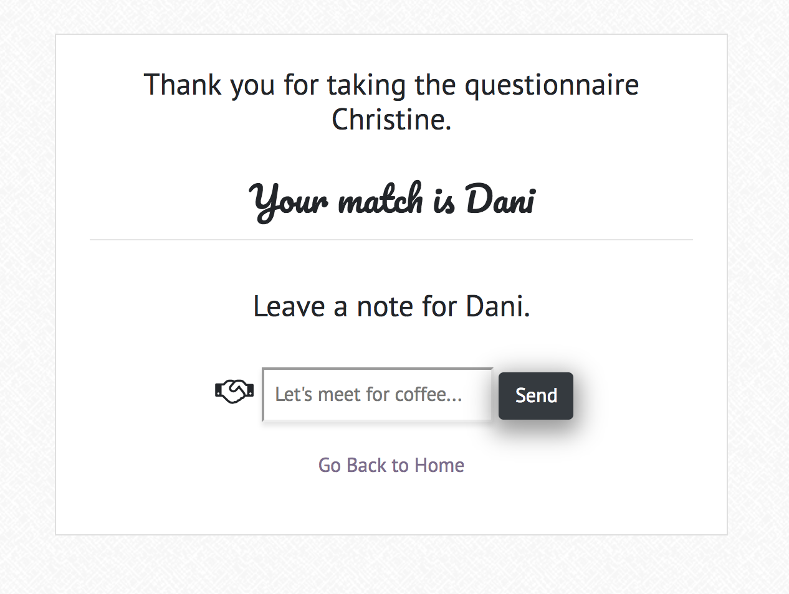

# Mentor Up

Mentor Up is a MERN stack application aimed at encouraging women in tech to seek out mentorship.  Users create an account and proceed to take a personality/matching questionnaire to find a mentor or mentee.  

Once paired, mentors & mentees have many options to communicate with each other through the app including 
* Chat
* Note and Goals residing in the Account page
* Video conferencing services such as Zoom, Google Hangouts, and Skype

Tech used to produce this app include: 
* [MongoDB & Mongoose](https://www.mongodb.com/)
* [Express.js](https://expressjs.com/en/guide/routing.html)
* [React](https://reactjs.org/)
* [Node.js](https://nodejs.org/en/)
* [Pusher Chatkit](https://pusher.com/chatkit)
* [MeetUp API](https://www.meetup.com/meetup_api/)
* [Passport Authentication](http://www.passportjs.org/)
* [Bootstrap](https://getbootstrap.com/)
* [Font Awesome Icons](https://fontawesome.com/v4.7.0/icons/)
* [Stock Image provided by Pexels](https://www.pexels.com/)

## Mobile Views

Users will first enter our app and see a home page, they will login or signup, then may proceed to take the questionnaire.  Once questionnaire answers are stored in the database, the next page will find a match.

## Desktop Views

